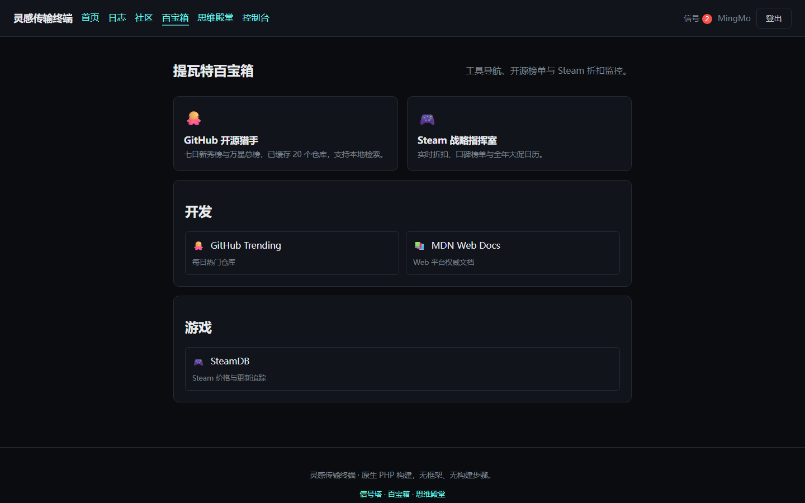

# 灵感传输终端 · Inspiration Terminal

> 一个用原生 PHP 手写的个人门户与社区网站：博客、匿名社区、游戏化经济系统与开发者工具箱。
> **无框架、无 Composer 依赖、无前端构建步骤** —— `git clone` 之后就能跑。

[](https://github.com/natsume05/inspiration-terminal/actions/workflows/ci.yml)
[](https://www.php.net/)
[](https://mariadb.org/)
[](tests/)
[](LICENSE)

**[English](README.en.md)** · 中文

---


---

## 这是什么

一个单人在业余时间做完、并真实上线运行过的全栈项目。它把四类东西放进同一个站点：

| 板块 | 内容 | 状态 |
|---|---|---|
| **深空日志** | 博客：列表、详情、Markdown 渲染、评论与点赞 | 完成 |
| **虚空枢纽** | 社区：发帖、评论、点赞、频道筛选、图片上传 | 完成 |
| **虚空经济** | 星尘虚拟货币：每日签到、概率掉落、分级抽奖、装备穿戴 | 完成 |
| **提瓦特百宝箱** | 工具箱：导航聚合、GitHub 榜单检索、Steam 折扣监控 | 完成 |

**先说清楚它不是什么**：这不是一个可以直接拿去开站的通用论坛系统，也没有多租户、
没有插件机制、没有后台权限分级。它是**一个人的站点**，代码公开是为了可以被阅读和学习。
如果你的需求是"部署一个社区"，成熟的开源论坛会更合适。

---

## 规模

这些数字可以逐个核对，没有一个是估的。

```
应用 PHP        61 文件    9,270 行      src/ routes/ templates/ bin/ bootstrap/ config/ public/
测试与工具      12 文件    1,960 行      tests/ tools/
首方前端 JS      6 文件      531 行      public/assets/js/（另含 2 个随仓库分发的库）
CSS              1 文件    1,007 行
────────────────────────────────────────────────────────────────
数据表                      23 张
外键                        25 个
唯一键                       7 个
CHECK 约束                   5 个
路由                        45 个
```

**验证状况**

| 项目 | 结果 |
|---|---|
| CI（PHP 8.1 / 8.2 / 8.3） | 全绿 |
| 单元断言 | 78 条 |
| 模块校验 | 64 条，可重复执行 |
| 真实数据库约束探针 | 6 条全通过 |
| 静态检查 | 69+ 文件 0 违规 |

---

## 技术栈

| 层 | 选型 | 说明 |
|---|---|---|
| 语言 | PHP 8.1+ | `declare(strict_types=1)`，PSR-4 自动加载 |
| 数据库 | MySQL 8 / MariaDB | 手写 SQL + PDO 具名占位符，23 张表 |
| 数据访问 | PDO | 关闭预处理仿真，异常模式，事务封装 |
| 会话 | 原生 session + 自研封装 | 自管存储目录、空闲超时、ID 轮换 |
| 前端 | 原生 HTML / CSS / ES Modules | Flexbox + Grid，**无构建工具、无框架** |
| 图片 | GD | 内容嗅探 → 缩放（保留 alpha）→ 统一转 WebP |
| 外部 API | cURL | GitHub REST、CheapShark，**服务端代理 + 落库缓存** |
| Markdown | marked + DOMPurify | `marked` → **净化** → DOM |
| 测试 | 自研轻量框架 | 零依赖，`git clone` 后直接可跑 |
| 部署 | Apache / Nginx / Docker | 文档根指向 `public/` |

### 为什么不用框架

项目规模不需要框架的收益，而我把请求生命周期、SQL 边界、会话与安全这些底层链路
真正写了一遍。代价我也清楚：**框架替我解决的依赖注入、路由、迁移、模板转义，
都要自己写对**——所以测试和文档在这个项目里不是可选项，而是写对它们的手段。

如果你正在选型：**项目比这更大、或要多人协作，就应该用框架。**

---

## 三个设计重点

### 1. 能在数据库层表达的约束，就不放在应用层

点赞、购买、签到最初都是"先查再写"。这种写法在并发下必然失效：两个请求可能
同时读到"不存在"，然后都插入。失效方式还很隐蔽——平时测不出来，只在真实并发下偶发。

现在这些约束由数据库强制：

| 规则 | 机制 |
|---|---|
| 一个用户只能赞同一帖一次 | `post_likes` 复合主键 `(user_id, post_id)` |
| 一个用户只能拥有一件物品 | `user_items` 复合主键 |
| 余额不会变成负数 | `UNSIGNED` **且** 显式 `CHECK (stardust >= 0)` |
| 删帖自动清理点赞 | 外键 `ON DELETE CASCADE` |
| 每天每种玩法限次 | `rate_limits` 复合主键 `(user_id, action, window_date)` |

代码用 `INSERT IGNORE`（MySQL）/ `ON CONFLICT DO NOTHING`（SQLite），
**再根据影响行数判断是否真的新增**，而不是相信自己的查询结果。

### 2. 横切关注点下沉到框架层

CSRF 校验最初写在每个接口里，结果 7 个写入口只覆盖了 2 个——包括改密码漏了。

现在校验在**路由层统一强制**：所有非安全方法（POST/PUT/PATCH/DELETE）在进入
任何 handler 之前校验 token。这样"新加一个路由忘记加校验"在结构上不可能发生，
因为它不再依赖开发者记得。

### 3. 测试要问"我测的是不是线上同一个引擎"

测试跑在 SQLite 上、复刻生产的 MySQL schema，速度快且不需要装数据库。
但一次真实数据库探针暴露了 SQLite 永远测不出的问题：

> XAMPP 捆绑的 MariaDB 的 `sql_mode` 缺少 `STRICT_TRANS_TABLES`。
> 非严格模式下，写入越界值被**静默修正**——写 `-5` 到 `UNSIGNED` 列，
> 实际存进去的是 `0`，只产生一条警告。更要紧的是 **`CHECK` 约束根本不会被求值**，
> 因为值在检查之前就已经被改掉了。

修法是在连接层强制严格模式，并把探针留成 `tools/verify-deployment.php` 纳入验收。
**测试通过不等于正确**，这是这个项目里我印象最深的一课。

---

## 安全

完整威胁模型与边界见 [`docs/security.md`](docs/security.md)。

| 威胁 | 措施 |
|---|---|
| SQL 注入 | PDO 具名占位符 + 真实预处理；`LIMIT/OFFSET` 显式绑整型；静态检查拦截插值 |
| XSS | 模板统一 `View::escape()`（有静态检查强制）；JS 用 `textContent` 构造 DOM；CSP `script-src 'self'` |
| CSRF | **路由层统一强制**；32 字节随机 token + `hash_equals`；登录/登出轮换；`SameSite=Lax` 为第二层 |
| 会话固定 | 登录时轮换 ID；每 15 分钟再轮换；2 小时空闲超时；`use_strict_mode` |
| 密码破解 | `password_hash(PASSWORD_DEFAULT)`；登录失败 5 次锁定 15 分钟 |
| 用户枚举 | 账号不存在时**照样跑一次密码校验**，使响应时间不泄露账号是否存在 |
| 越权 | 所有私有数据的查询**把 `user_id` 写进 SQL 条件**，而非查出来后判断 |
| 上传攻击 | 七层校验：传输 → 来源 → 大小 → 内容类型 → 像素数 → 重编码 → 文档根之外 |
| 密钥泄露 | 只从环境变量读，**不保留硬编码回退值** |
| 点击劫持 | `X-Frame-Options: DENY` + CSP `frame-ancestors 'none'` |

**已知边界**（不是疏忽，是取舍）：

- 私密笔记用 AES-256-GCM 加密，密钥在环境变量。**防数据库泄露，不防主机被完全控制**；
  `APP_KEY` 丢失则笔记永久不可恢复。
- 限流存在数据库里，多实例部署需要换成 Redis 这类共享存储。
- 没有二次验证，也没有上游 WAF。

---

## 快速开始

### 方式一：Docker（无需安装任何东西）

```bash
git clone https://github.com/natsume05/inspiration-terminal.git
cd inspiration-terminal
cp .env.example .env
# 生成应用密钥并填入 APP_KEY
php -r "echo bin2hex(random_bytes(32)), PHP_EOL;"
docker compose up -d
```

打开 <http://localhost:8080>，用 `demo@example.com` / `demo-password` 登录。

### 方式二：本机 PHP

要求 PHP 8.1+ 与 `pdo_mysql`（或 `pdo_sqlite`）、`mbstring`、`json`；
图片处理需要 `gd`，外部 API 需要 `curl`，笔记加密需要 `openssl`。

```bash
cp .env.example .env      # 填好 APP_KEY 与 DB_*
php bin/migrate.php       # 建表
php bin/seed-demo.php     # 写入演示数据（可选）
php -S 127.0.0.1:8080 -t public
```

> **文档根必须指向 `public/`。** `public/index.php` 是唯一入口，
> 配置、迁移、测试都在它之外，因此从 HTTP 层面不可达。

### 只看界面、不想装数据库

```bash
php bin/dev-sqlite.php
DB_DRIVER=sqlite DB_SQLITE_PATH=storage/dev.sqlite \
APP_KEY=0123456789abcdef0123456789abcdef \
php -S 127.0.0.1:8080 -t public
```

<details>
<summary>Windows 上 <code>php</code> 命令不识别？</summary>

XAMPP 不会把 PHP 加进 `PATH`。用完整路径，或临时加入：

```powershell
D:\XAMPP\php\php.exe bin\migrate.php --status

# 或者
$env:Path += ';D:\XAMPP\php'
php bin/migrate.php --status
```
</details>

---

## 界面

| | |
|---|---|
|  |  |
| 深空日志：列表、封面与摘要 | 日志详情：Markdown 渲染、评论与点赞 |
|  |  |
| 虚空枢纽：发帖、点赞、评论折叠 | 思维殿堂：AES-256-GCM 加密的私密笔记 |
|  |  |
| 提瓦特百宝箱：导航与榜单入口 | 舰长控制台：广播、日志、账号与反馈 |
|  |  |
| GitHub 开源猎手：缓存榜单与本地检索 | Steam 战略指挥室：折扣与大促日历 |
|  |  |
| 移动端布局 | 操作日志：可追溯的关键动作 |

所有截图由 [`tools/capture-screenshots.mjs`](tools/capture-screenshots.mjs) 从真实运行
的站点抓取，包括登录后的页面。该脚本会拒绝产出重复的图片——因为"每张截图都一模一样"
这种失败在图片里看不出来。

### 在线演示

生产站点部署在 **<https://367588.xyz>**。需要说明两点：
这是**个人站点而非稳定演示环境**，访问内容可能随时变更，也可能正在部署新版本；
如果想确认这份代码本身的效果，Docker 方式更可靠。

---

## 项目结构

```
inspiration-terminal/
├── public/                 # 唯一的 Web 根
│   ├── index.php           # 前端控制器
│   └── assets/             # CSS、ES Module、图片
├── src/
│   ├── Database/           # 连接、迁移器、方言适配、旧数据导入
│   ├── Http/               # 请求、响应、路由、内核、视图
│   ├── Repository/         # 数据访问 —— SQL 只允许出现在这里
│   ├── Security/           # 会话、CSRF、校验、加密、上传、安全头
│   ├── Service/            # 业务规则
│   └── Support/            # 配置与环境变量
├── routes/web.php          # 路由表
├── templates/              # 视图
├── database/migrations/    # 迁移，按序号执行
├── tests/                  # 测试套件
├── tools/                  # 静态检查、截图、部署与校验脚本
├── bin/                    # 命令行入口
└── docs/                   # 文档
```

**依赖方向是单向的**，并且被 `tools/lint.php` 机械化强制：

```
Http → Service → Repository → Database
                    ↑
              Security（可被各层使用）

SQL 只允许出现在 Repository
业务规则只允许出现在 Service
模板只负责渲染，每个输出必须显式转义
```

---

## 文档

| 文档 | 内容 |
|---|---|
| [`docs/project-overview.md`](docs/project-overview.md) | 项目全貌：23 张表设计、请求流向、四个关键数据流 |
| [`docs/security.md`](docs/security.md) | 威胁模型、已实现措施、已知边界 |
| [`docs/deployment.md`](docs/deployment.md) | 从本地到生产服务器的完整步骤与检查清单 |
| [`docs/interview-questions.md`](docs/interview-questions.md) | 40 题问答，围绕本项目的真实设计与缺陷 |
| [`CHANGELOG.md`](CHANGELOG.md) | 版本变更记录 |
| [`SECURITY.md`](SECURITY.md) | 漏洞报送方式与支持范围 |
| [`NOTICE`](NOTICE) | 第三方组件与媒体素材的授权情况 |

---

## 开发

```bash
php tests/run.php              # 全部测试
php tests/run.php --verbose     # 逐条断言
php tools/lint.php              # 静态检查（分层边界、SQL 插值、模板转义）
php tools/lint.php --verbose    # 同时列出被放行的模板输出及其原因
php bin/migrate.php --status    # 迁移状态
php tools/verify-deployment.php # 对真实数据库校验约束
```

静态检查里有一条值得一提的规则：模板输出必须转义。它对**可能产出**不可信内容的
表达式报错，而对"只返回字符串字面量的三元表达式"这类明确安全的写法放行，
并且把每一次放行都在 `--verbose` 下列出来。**规则如果太吵，就会被无视——
那比没有规则更糟。**

---

## 已知边界

诚实交付，下面这些都是明确的，不是疏忽：

- **没用框架**，所以路由与模板能力是刻意做小的。复杂项目应当选框架。
- **没有队列**，图片处理与外部 API 调用都在请求内同步完成。
- **限流表的清理没接定时任务**，`pruneBefore()` 需要手动调用。
- **并发保证来自数据库约束与探针验证**，还没有"多进程同时打同一接口"的集成测试。
- **界面只有中文**，没有做 i18n。
- **`bin/migrate-legacy.php` 只支持 MySQL** —— 它按定义就是从旧的 MySQL 读数据，
  所以不像仓储层那样需要兼容 SQLite。

---

## 贡献

**这是一个个人项目，不接收外部 Pull Request。** 代码公开是为了可被阅读，
而不是为了被共同开发——写这句话是为了不给出一个我无法兑现的承诺。

如果你发现了**安全问题**，请不要开公开 issue，按 [`SECURITY.md`](SECURITY.md)
的流程私下报送。如果只是发现了普通缺陷或想讨论设计，欢迎开 issue。

---

## 授权

- **代码**：[MIT](LICENSE) —— 随便用，包括商用。
- **站点内容**（文章、截图、文案、图片）：[CC BY-NC-ND 4.0](LICENSE-CONTENT) ——
  可以引用和转载（需署名与链接），不可商用、不可改编后再发布。
- **第三方组件**：见 [`NOTICE`](NOTICE)。随仓库分发的 `marked`（MIT）与
  DOMPurify（Apache-2.0）各自保留其许可。

---

<p align="center">
  <sub>界面风格取自若干游戏的视觉语言，属于个人项目的致敬式引用，与这些游戏及其发行商无隶属关系。</sub>
</p>
