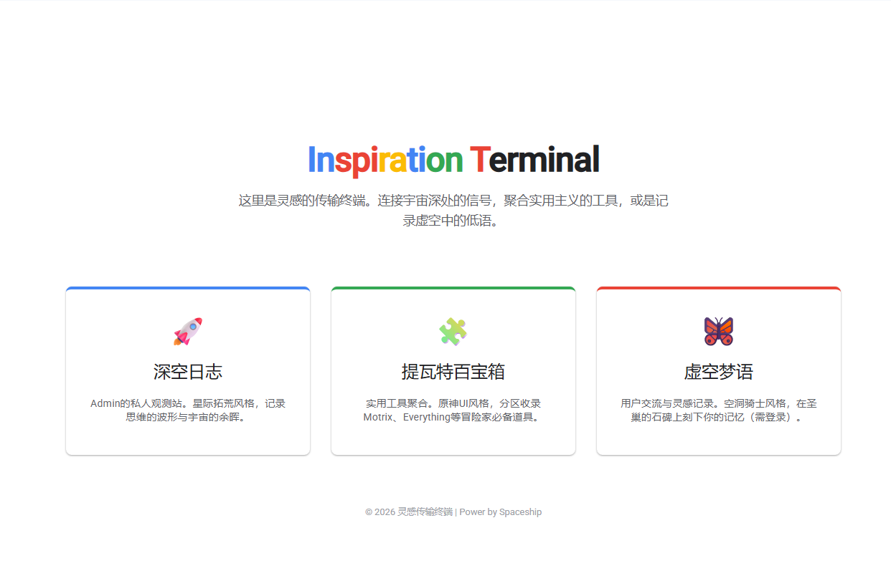
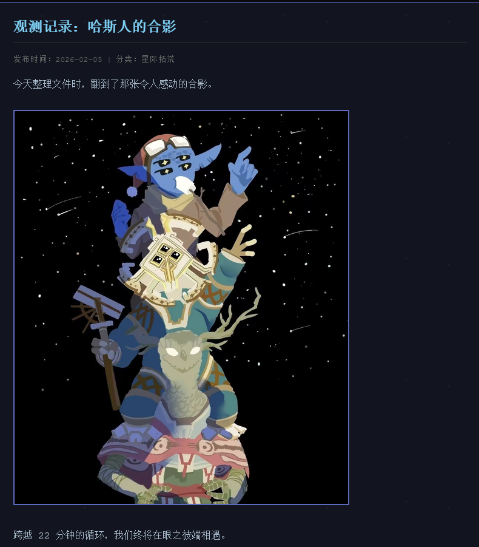
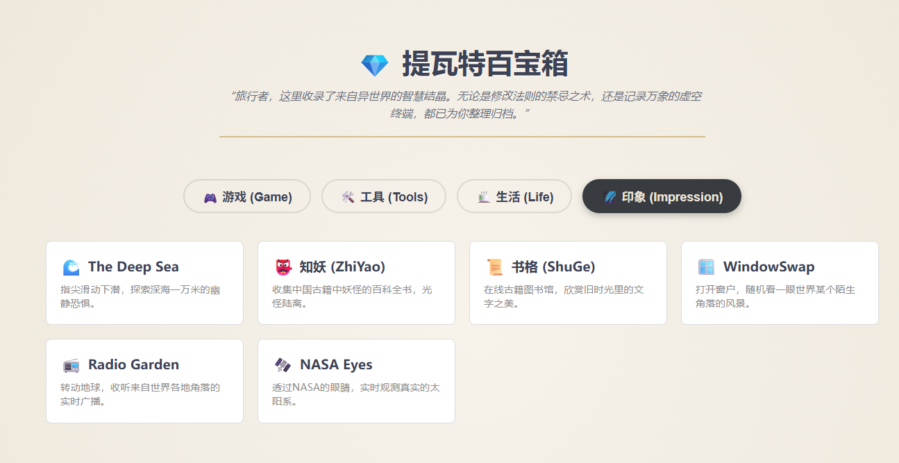
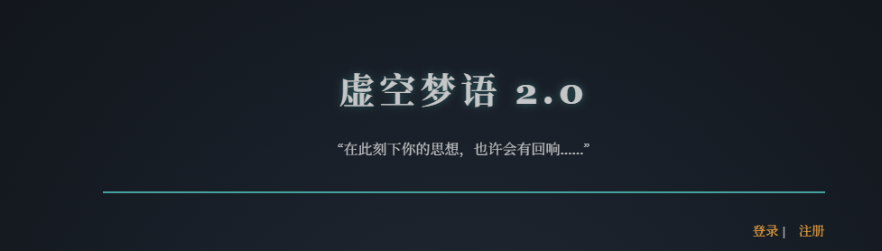

# 🚀 灵感传输终端 (Inspiration Terminal)

  

> “无论代价如何，在此刻下你的思想……”

这是一个集成了**博客**、**工具箱**与**匿名社区**的个人门户网站。作为我的全栈开发入门项目，它融合了《星际拓荒》、《空洞骑士》与《原神》的视觉风格。

## ✨ 功能特性 (Features)

### 🌌 虚空梦语（社区版块）
- **匿名发帖**：基于 MySQL 数据库的留言板机制。
- **互动系统**：支持点赞（心跳特效）、评论（折叠/展开）与链接分享。
- **人性化体验**：由 PHP 后端处理的“几分钟前”时间显示算法。
- **权限管理**：管理员账号拥有删帖权限。

### 👤 个人中心 (Profile)
- **身份系统**：完整的注册/登录流程，含图形验证码。
- **隐私空间**：加密存储的私人笔记功能。
- **档案管理**：支持修改头像、签名与个人信息。

### 🛠️ 提瓦特百宝箱
- 实用工具导航聚合，动态分类切换。
- **GitHub 开源猎手**：热门项目榜单与敏感内容过滤搜索。
- **Steam 战略指挥室**：史低监控、大促日历与口碑榜单。

## 📁 目录结构

```
inspiration/
├── index.php              # 主页（广播弹窗 + 入口卡片）
├── blog.php               # 深空日志（博客列表）
├── view_post.php          # 日志详情页
├── community.php          # 虚空枢纽（大厅）
├── channel.php            # 深空频道（发帖/点赞/评论）
├── profile.php            # 个人档案
├── feedback.php           # 信号塔（反馈与答疑）
├── private_notes.php      # 私密树洞
├── secret_space.php       # 思维殿堂（私密笔记）
├── delete_post.php        # 管理员删帖
├── shop.php               # 星尘交易所
├── games.php              # 娱乐终端（施工中）
├── level_rules.php        # 等级协议说明
├── tools.php              # 百宝箱入口
├── tools_github.php       # GitHub 开源猎手
├── tools_links.php        # 星际导航终端
├── steam.php              # Steam 战略指挥室
├── login.php / register.php / logout.php
├── terms.php / privacy.php
├── api_checkin.php        # 每日补给接口
├── api_comment.php        # 评论接口
├── api_like.php           # 点赞接口
├── api_shop.php           # 商店/抽奖/装备接口
├── api_search_github.php  # GitHub 搜索接口
├── api_steam.php          # Steam 代理接口
├── fetch_github.php       # 榜单数据抓取
└── includes/
    ├── config.php         # 常量与密钥
    ├── db.php             # 数据库连接 + 会话初始化
    ├── helpers.php        # 通用工具函数层
    ├── drop_system.php    # 虚空掉落逻辑
    ├── csrf.php           # CSRF 防护
    ├── header.php         # 页面头部
    ├── footer.php         # 页面底部
    ├── image_helper.php   # 图片压缩 (WebP)
    ├── level_system.php   # 经验与等级
    └── item_loader.php    # 用户装扮加载
```

## 🛠️ 技术栈 (Tech Stack)

- **Frontend**: HTML5, CSS3 (Flexbox/Grid), Vanilla JS
- **Backend**: Native PHP（无框架纯手写，已验证 PHP 8.2）
- **Database**: MySQL / MariaDB
- **Environment**: XAMPP (Local), cPanel (Production)

## 🚀 本地部署

1. 使用 XAMPP 启动 Apache 与 MySQL，将项目放入 `htdocs/`。
2. 创建数据库 `my_forum` 并导入数据表结构。
3. 按需修改 `includes/db.php` 中的数据库连接信息。
4. 在 `includes/config.php` 中通过环境变量 `GITHUB_TOKEN` 配置 GitHub API 令牌（用于榜单抓取与搜索）。
5. 访问 `index.php`。

> 安全提醒：`includes/config.php` 与 `includes/db.php` 已被 `.gitignore` 忽略，请勿将真实密钥提交到仓库。

## 📸 预览 (Screenshots)






## 📝 开发日志 (Dev Log)

- **2026.08.16** - 代码结构重构：拆分通用工具层 `helpers.php`、掉落系统 `drop_system.php`；全面参数化 SQL 消除注入风险；修复点赞接口双 JSON、签到余额不同步、部分页面缺库依赖等隐性 bug；统一代码风格。
- **2026.02.07** - 成功完成本地化部署 (XAMPP)，解决数据库编码与时区问题。
- **2026.02.06** - 实现用户登录与图形验证码系统。
- **2026.02.05** - 初步完成《空洞骑士》风格 UI 设计。

---

*Created by [MingMo](https://github.com/natsume05)*
