# 灵感传输终端 · Inspiration Terminal

> 一个用原生 PHP 手写的个人门户与社区网站：博客、匿名社区、游戏化经济系统与开发者工具箱。
> **无框架、无 Composer 依赖、无前端构建步骤** —— `git clone` 之后就能跑。

[](https://github.com/natsume05/inspiration-terminal/actions/workflows/ci.yml)
[](https://www.php.net/)
[](https://mariadb.org/)
[](tests/)
[](LICENSE)

**[English](README.en.md)** · 中文

---

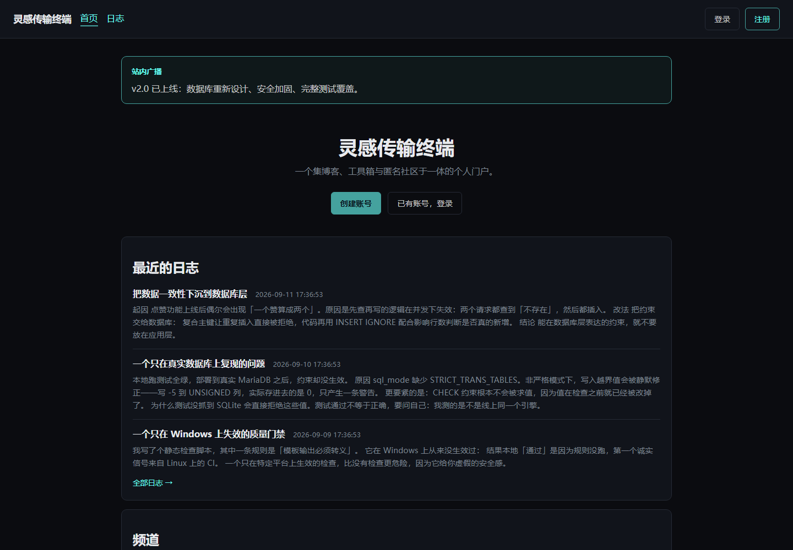

---

## 这是什么

一个单人在业余时间做完、并真实上线运行过的全栈项目。它把四类东西放进同一个站点：

| 板块 | 内容 | 状态 |
|---|---|---|
| **深空日志** | 博客：列表、详情、Markdown 渲染、评论与点赞 | 完成 |
| **虚空枢纽** | 社区：发帖、评论、点赞、频道筛选、图片上传、Markdown 与表情 | 完成 |
| **虚空经济** | 星尘虚拟货币：每日签到、概率掉落、分级抽奖、装备穿戴 | 完成 |
| **提瓦特百宝箱** | 工具箱：导航聚合、GitHub 榜单检索、Steam 折扣监控 | 完成 |

**先说清楚它不是什么**：这不是一个可以直接拿去开站的通用论坛系统，也没有多租户、
没有插件机制、没有后台权限分级。它是**一个人的站点**，代码公开是为了可以被阅读和学习。
如果你的需求是“部署一个社区”，成熟的开源论坛会更合适。

**还有三件应该一开始就说的事**：界面只有中文；仓库里没有运行时依赖，
`composer.json` 只声明 PHP 版本与扩展要求，**不需要 `composer install` 就能跑**；
页面本身也没有构建步骤，`public/` 里的文件就是浏览器拿到的文件。

生产站点在 **<https://367588.xyz>**。这是**个人站点而非稳定演示环境**，
内容随时可能变更，也可能正在部署新版本；想确认这份代码本身的效果，用 Docker 更可靠。

---

## 功能一览

### 深空日志（博客）

- **列表**带封面、摘要、作者与评论数，按发布时间倒序，分页浏览。
- **详情页按 slug 寻址**（`/blog/把数据一致性下沉到数据库层-1`），
  这让链接是稳定的，而不是一条带自增 ID 的地址。
- **Markdown 渲染**，且是“渲染后净化”而非直接插入：`marked` 负责转换，
  `DOMPurify` 负责消毒，**顺序不能颠倒**——`marked` 自身不做任何净化，
  而 Markdown 允许嵌原始 HTML，直接插入等于开一个 XSS 口子。
- **评论对访客开放**。未登录读者填一个称呼即可留言，登录读者则自动带上当前昵称。
  昵称在写入时固化，因此改名不会让历史评论跟着变。
- **点赞**依赖 `(blog_post_id, user_id)` 复合主键去重。

### 虚空枢纽（社区）

- **发帖**支持配图，上传后由 GD 统一转成 WebP。
- **帖子正文与日志共用同一条渲染管线**：`marked` 转换、`DOMPurify` 净化。
  这不是顺手加的——旧站的内容里就有 Markdown 和一整段粘进去的 HTML，
  换成纯文本渲染之后，那些帖子会原样显示成 `## 标题` 和裸标签。
- **`[s:name]` 表情**：旧站用这种记号存表情，迁移过来的内容里大量出现。
  展开表放在 `assets/js/emojis.js` 一处，渲染器和表情面板共用同一份，
  所以两者不可能对不上。**认不出的记号原样保留**，而不是从句子中间被删掉。
- **正文在服务端先渲染一份纯文本再交给前端**。脚本没加载成功时读者看到的是文字，
  而不是一段空白——“渲染失败”和“这篇文章是空的”是两回事。
- **频道筛选**：日常吐槽 / 游戏圣殿 / 代码深空 / 虚空回响。
- **评论折叠展开**，按需从 JSON 接口加载，而不是把整个会话一次性渲染进页面。
- **点赞与掉落联动**：点赞可能触发“虚空回响”并送出少量星尘，但**每天至多一次**。

### 虚空经济（星尘系统）

这是全项目里设计得最细的一块，也是最容易被做坏的一块。

- **每日签到**：随机 20–50 星尘加 20 经验。幂等由 `rate_limits` 的复合主键保证，
  重复请求会被拒绝而不会重复发放。
- **评论与发帖奖励按天封顶**。早期版本这里是无限刷的——写一句“好”重复提交就能
  无限产出星尘，整个经济会崩。这是被修掉的真实漏洞，不是假设。
- **分级抽奖**：每天一次。60% 出星尘碎片，其余按稀有度抽取未拥有的物品；
  某一稀有度已集满时改为结算星尘，**不会出现“抽中但没有东西给你”的空奖**。
- **装备穿戴**：同类型互斥。分成名字特效、头像框、徽章三类，
  用一条 `UPDATE ... JOIN` 批量卸下同类再装备目标，两步同事务。
- **余额不会为负**：列为 `UNSIGNED`，并另加显式 `CHECK (stardust >= 0)`。
  两道约束并列是刻意的——`UNSIGNED` 的行为取决于数据库的 `sql_mode`，
  显式 `CHECK` 不依赖配置。

### 提瓦特百宝箱（工具箱）

- **导航聚合**：按分类展示，图标缺失时回落到通用图标，而不是留一块空白。
- **GitHub 开源猎手**：两个榜单（七日新秀、万星总榜）来自**本地缓存**，
  按仓库名、简介与语言检索。走缓存而不是实时接口，是为了不消耗接口额度，
  也让**没有配置令牌时依然可用**。
- **Steam 战略指挥室**：折扣数据由**服务端代理**请求并缓存，
  浏览器不直连第三方；全年大促日历是本地编辑内容，因此上游不可用时它仍然显示。
  上游失败时会继续展示上一次成功的数据，而不是把面板留空。

### 个人档案与私密笔记

- 修改显示名与签名、上传头像、重置密钥。**重置密钥会轮换会话标识**，
  使旧凭据建立的会话不再有效。
- **思维殿堂**：私密笔记用 AES-256-GCM 加密，密钥由 `APP_KEY` 派生且不入库，
  因此单纯导出数据库读不出内容。代价写在明处：`APP_KEY` 丢失即永久不可读。

### 舰长控制台（管理）

- **站内广播**发布后会显示在首页；可选同时向所有活跃账号发送站内通知。
- **发布与管理日志**、**管理导航链接**。
- **账号管理**：授予称号、调整角色、停用与恢复。
  管理员**不能修改自己的角色**——那可能让站点再没有人能管理它，且无法从界面恢复。
- **处理反馈**并回复，回复会通知提交者。
- **操作日志**（`/admin/audit`）只增不改，记录登录成功与失败、登出、
  发帖、评论、广播、日志与工具的增删。**登录结果也记录在案**：
  登录限流是按 IP 做的，如果不记下结果，就无法回答“这个地址在猜哪些账号”
  ——以及它在锁定期满之后是否换了目标。被锁定而拒绝的请求同样入库。

### 通知

评论、点赞、奖励与系统广播都会生成站内通知，导航栏显示未读数。
通知者不会收到自己行为的通知——这条规则写在仓储层，因此新调用点不会漏掉。

---

## 规模

下面的数字是数出来的，不是估的——每一条都能用 `wc -l` 在这个仓库里复核一遍。
行数按换行符计，因此压缩过的第三方库不计入“首方 JS”。

```
应用 PHP        63 文件   11,691 行      src/ routes/ templates/ bin/ bootstrap/ config/ public/
测试与工具      16 文件    3,139 行      tests/ tools/
首方前端 JS      8 文件      893 行      public/assets/js/（另含 2 个随仓库分发的压缩库）
CSS              1 文件    1,678 行      public/assets/css/
────────────────────────────────────────────────────────────────
数据表                      23 张
外键                        25 个
唯一键                       7 个
CHECK 约束                   5 个
路由                        45 个
```

**验证状况**

下列结果来自当前工作树，不是某次历史构建的记录。

| 项目 | 结果 |
|---|---|
| CI（PHP 8.1 / 8.2 / 8.3） | 全绿 |
| 单元断言 | 92 条 / 3 个套件 |
| 模块校验 | 83 条，可重复执行 |
| 真实数据库约束探针 | 6 条全通过 |
| 静态检查 | 75 个文件 0 违规 |
| 文档链接与编码 | 10 个文档 / 61 条本地链接 |

这两项——模块校验与静态检查——都能跑在 **MySQL** 上，不只是 SQLite。
做到这一点花了些功夫，也确实收回成本：本项目里三个只在 MySQL 上炸的缺陷，
在 SQLite 上全部“通过”。详见[第三个设计重点](#3-测试要问我测的是不是线上同一个引擎)。

---

## 技术栈

| 层 | 选型 | 说明 |
|---|---|---|
| 语言 | PHP 8.1+ | `declare(strict_types=1)`，PSR-4 自动加载 |
| 数据库 | MySQL 8 / MariaDB | 手写 SQL + PDO 具名占位符，23 张表 |
| 数据访问 | PDO | 关闭预处理仿真，异常模式，事务封装 |
| 会话 | 原生 session + 自研封装 | 自管存储目录、空闲超时、ID 轮换 |
| 前端 | 原生 HTML / CSS / ES Modules | Flexbox + Grid，**无构建工具、无框架** |
| 图片 | GD | 内容嗅探 → 缩放（保留 alpha）→ 统一转 WebP |
| 外部 API | cURL | GitHub REST、CheapShark，**服务端代理 + 落库缓存** |
| Markdown | marked + DOMPurify | `marked` → **净化** → DOM |
| 测试 | 自研轻量框架 | 零依赖，`git clone` 后直接可跑 |
| 部署 | Apache / Nginx / Docker | 文档根指向 `public/` |

### 为什么不用框架

项目规模不需要框架的收益，而我把请求生命周期、SQL 边界、会话与安全这些底层链路
真正写了一遍。代价我也清楚：**框架替我解决的依赖注入、路由、迁移、模板转义，
都要自己写对**——所以测试和文档在这个项目里不是可选项，而是写对它们的手段。

如果你正在选型：**项目比这更大、或要多人协作，就应该用框架。**

---

## 三个设计重点

### 1. 能在数据库层表达的约束，就不放在应用层

点赞、购买、签到最初都是“先查再写”。这种写法在并发下必然失效：两个请求可能
同时读到“不存在”，然后都插入。失效方式还很隐蔽——平时测不出来，只在真实并发下偶发。

现在这些约束由数据库强制：

| 规则 | 机制 |
|---|---|
| 一个用户只能赞同一帖一次 | `post_likes` 复合主键 `(user_id, post_id)` |
| 一个用户只能拥有一件物品 | `user_items` 复合主键 |
| 余额不会变成负数 | `UNSIGNED` **且** 显式 `CHECK (stardust >= 0)` |
| 删帖自动清理点赞 | 外键 `ON DELETE CASCADE` |
| 每天每种玩法限次 | `rate_limits` 复合主键 `(user_id, action, window_date)` |

代码用 `INSERT IGNORE`（MySQL）/ `ON CONFLICT DO NOTHING`（SQLite），
**再根据影响行数判断是否真的新增**，而不是相信自己的查询结果。

### 2. 横切关注点下沉到框架层

CSRF 校验最初写在每个接口里，结果 7 个写入口只覆盖了 2 个——包括改密码漏了。

现在校验在**路由层统一强制**：所有非安全方法（POST/PUT/PATCH/DELETE）在进入
任何 handler 之前校验 token。这样“新加一个路由忘记加校验”在结构上不可能发生，
因为它不再依赖开发者记得。

### 3. 测试要问“我测的是不是线上同一个引擎”

测试跑在 SQLite 上、复刻生产的 MySQL schema，速度快且不需要装数据库。
但一次真实数据库探针暴露了 SQLite 永远测不出的问题：

> XAMPP 捆绑的 MariaDB 的 `sql_mode` 缺少 `STRICT_TRANS_TABLES`。
> 非严格模式下，写入越界值被**静默修正**——写 `-5` 到 `UNSIGNED` 列，
> 实际存进去的是 `0`，只产生一条警告。更要紧的是 **`CHECK` 约束根本不会被求值**，
> 因为值在检查之前就已经被改掉了。

修法是在连接层强制严格模式，并把探针留成 `tools/verify-deployment.php` 纳入验收。
**测试通过不等于正确**，这是这个项目里我印象最深的一课。

同一课后来又上了两遍。连接关闭了预处理仿真（`ATTR_EMULATE_PREPARES => false`），
于是 MySQL 会拒绝**同一个具名占位符用两次**，而 SQLite 欣然接受：

| 位置 | 后果 | SQLite 上的表现 |
|---|---|---|
| `EconomyRepository::debit()` | 买东西时抛 `HY093`，**商店整条购买链路不可用** | 28 条经济断言全绿 |
| `bin/seed-demo.php` 的点赞计数 | 播种到第八条帖子时中断 | 同一份脚本一切正常 |
| `Excerpt::from()` 多留一个字符 | 写 `VARCHAR(320)` 时报 `Data too long` | 超长字符串照写不误，然后被悄悄截断 |

第三个尤其值得记下来：它正好差**一个字符**——占位符是 `mb_substr(..., 0, 320)` 再拼一个
省略号。SQLite 不在乎，MySQL 直接拒绝写入。现在摘要的长度是“结果上限”而不是
“保留字数”，并且有断言盯着它不超过列宽。

前两个现在由一条**静态检查规则**守着：同一条 SQL 字符串里出现重复具名占位符即报错。
这条规则加进去的当场就抓出了 `debit()`。而模块校验也补上了原来完全没碰的经济模块，
并且可以指向 MySQL 运行——这才是“在同一个引擎上测”的字面意思。

---

## 安全

完整威胁模型与边界见 [`docs/security.md`](docs/security.md)。

| 威胁 | 措施 |
|---|---|
| SQL 注入 | PDO 具名占位符 + 真实预处理；`LIMIT/OFFSET` 显式绑整型；静态检查拦截插值 |
| XSS | 模板统一 `View::escape()`（有静态检查强制）；JS 用 `textContent` 构造 DOM；CSP `script-src 'self'` |
| CSRF | **路由层统一强制**；32 字节随机 token + `hash_equals`；登录/登出轮换；`SameSite=Lax` 为第二层 |
| 会话固定 | 登录时轮换 ID；每 15 分钟再轮换；2 小时空闲超时；`use_strict_mode` |
| 密码破解 | `password_hash(PASSWORD_DEFAULT)`；登录失败 5 次锁定 15 分钟 |
| 用户枚举 | 账号不存在时**照样跑一次密码校验**，使响应时间不泄露账号是否存在 |
| 越权 | 所有私有数据的查询**把 `user_id` 写进 SQL 条件**，而非查出来后判断 |
| 上传攻击 | 七层校验：传输 → 来源 → 大小 → 内容类型 → 像素数 → 重编码 → 文档根之外 |
| 密钥泄露 | 只从环境变量读，**不保留硬编码回退值** |
| 点击劫持 | `X-Frame-Options: DENY` + CSP `frame-ancestors 'none'` |

**已知边界**（不是疏忽，是取舍）：

- 私密笔记用 AES-256-GCM 加密，密钥在环境变量。**防数据库泄露，不防主机被完全控制**；
  `APP_KEY` 丢失则笔记永久不可恢复。
- 限流存在数据库里，多实例部署需要换成 Redis 这类共享存储。
- 没有二次验证，也没有上游 WAF。

---

## 快速开始

### 方式一：Docker（无需安装任何东西）

```bash
git clone https://github.com/natsume05/inspiration-terminal.git
cd inspiration-terminal
cp .env.example .env
# 生成应用密钥并填入 APP_KEY
php -r "echo bin2hex(random_bytes(32)), PHP_EOL;"
docker compose up -d
```

打开 <http://localhost:8080>，用 **`MingMo` / `demo-password`** 登录。
（账号创建时会写入 `demo@example.com`，但登录只接受代号，不接受邮箱。）

### 方式二：本机 PHP

要求 PHP 8.1+ 与 `pdo_mysql`（或 `pdo_sqlite`）、`mbstring`、`json`；
图片处理需要 `gd`，外部 API 需要 `curl`，笔记加密需要 `openssl`。

```bash
cp .env.example .env      # 填好 APP_KEY 与 DB_*
php bin/migrate.php       # 建表
php bin/seed-demo.php     # 写入演示数据（可选）
php -S 127.0.0.1:8080 -t public
```

> **文档根必须指向 `public/`。** `public/index.php` 是唯一入口，
> 配置、迁移、测试都在它之外，因此从 HTTP 层面不可达。

### 只看界面、不想装数据库

```bash
php bin/dev-sqlite.php
DB_DRIVER=sqlite DB_SQLITE_PATH=storage/dev.sqlite \
APP_KEY=0123456789abcdef0123456789abcdef \
php -S 127.0.0.1:8080 -t public
```

这条路径只建表并写入最小数据集，登录用 **`MingMo` / `inspiration-dev-password`**。
想看首页、日志与百宝箱这类公开页面，甚至不需要登录。

<details>
<summary>Windows 上 <code>php</code> 命令不识别？</summary>

XAMPP 不会把 PHP 加进 `PATH`。用完整路径，或临时加入：

```powershell
D:\XAMPP\php\php.exe bin\migrate.php --status

# 或者
$env:Path += ';D:\XAMPP\php'
php bin/migrate.php --status
```
</details>

### 在线演示

生产站点部署在 **<https://367588.xyz>**。需要说明两点：
这是**个人站点而非稳定演示环境**，访问内容可能随时变更，也可能正在部署新版本；
如果想确认这份代码本身的效果，Docker 方式更可靠。

---

## 界面

| | |
|---|---|
|  | 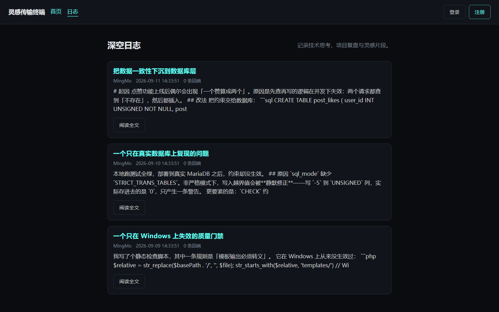 |
| 首页：站内广播、最近的日志、频道入口 | 深空日志：封面、摘要与分页 |
| 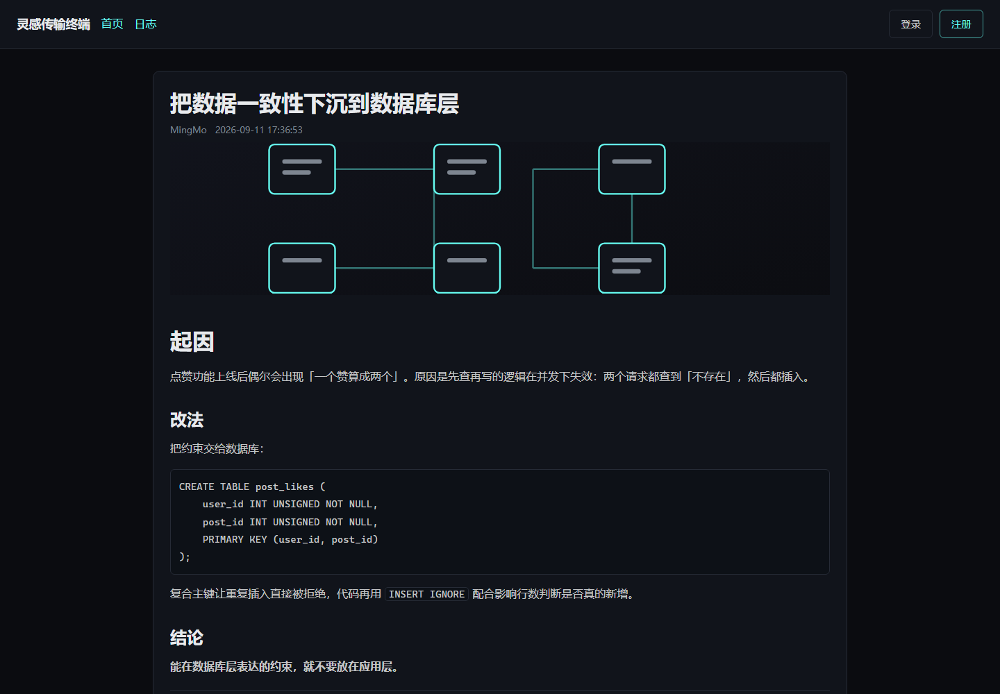 | 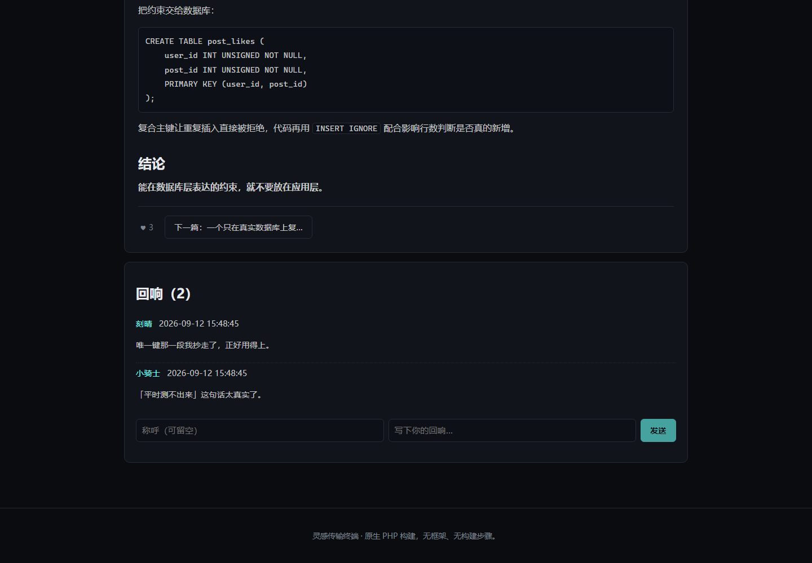 |
| 日志详情：Markdown 正文与代码块 | 同一篇的末尾：点赞与回响列表 |
| 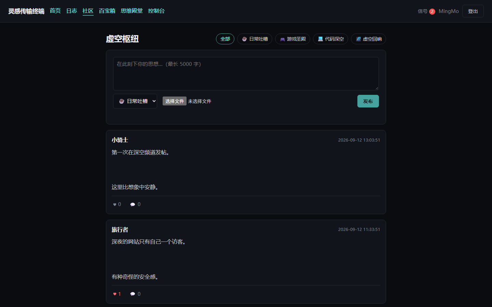 | 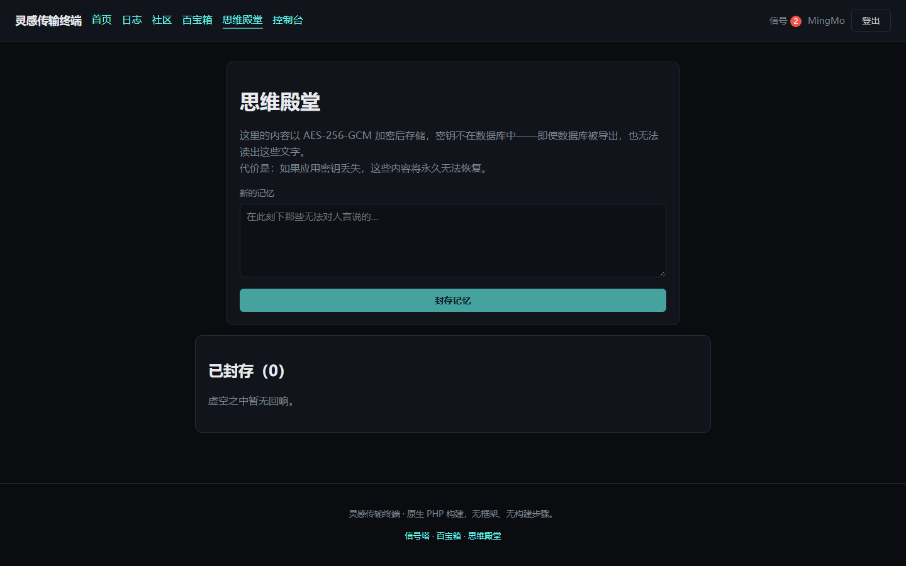 |
| 虚空枢纽：帖子按 Markdown 与 `[s:name]` 渲染 | 思维殿堂：AES-256-GCM 加密的私密笔记 |
| 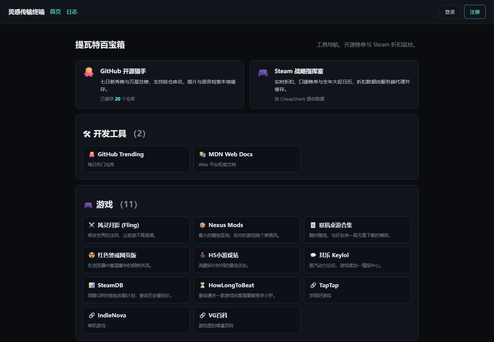 | 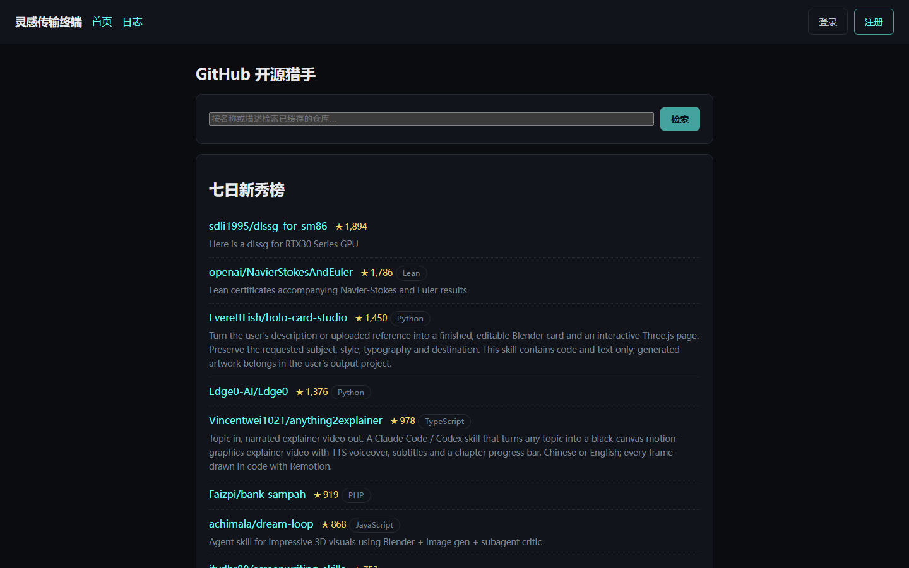 |
| 提瓦特百宝箱：按分类聚合的导航 | GitHub 开源猎手：本地缓存榜单与检索 |
| 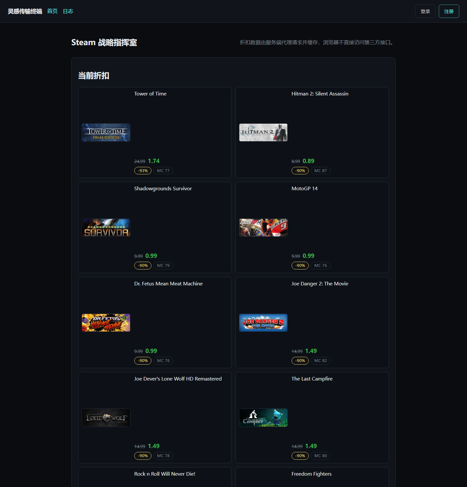 | 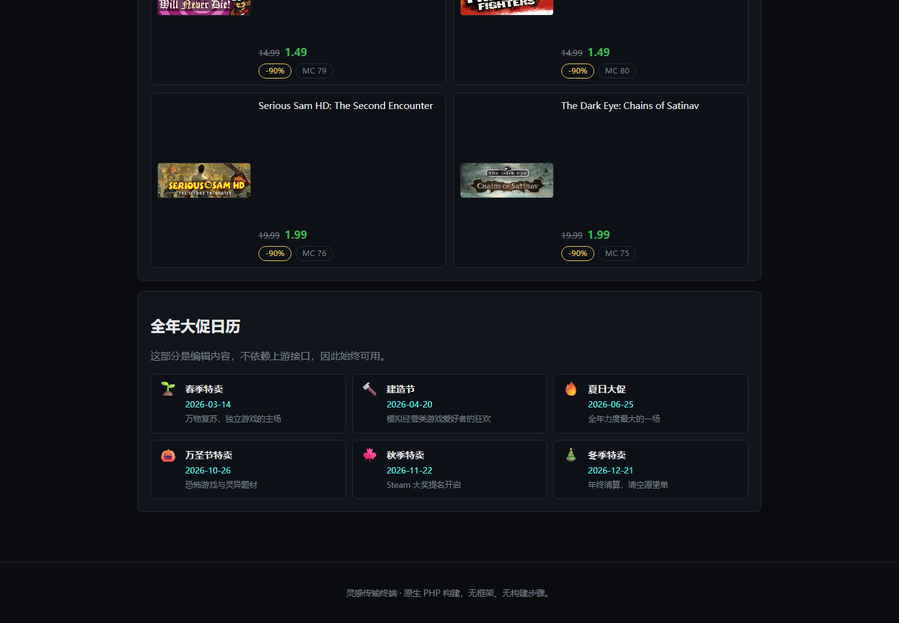 |
| Steam 战略指挥室：折扣与价格 | 同一页往下：全年大促日历 |
| 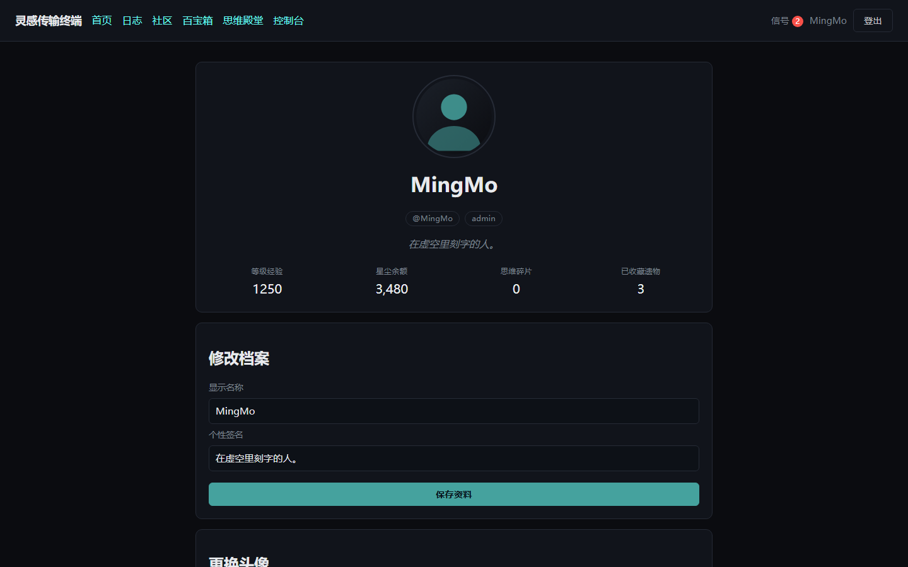 | 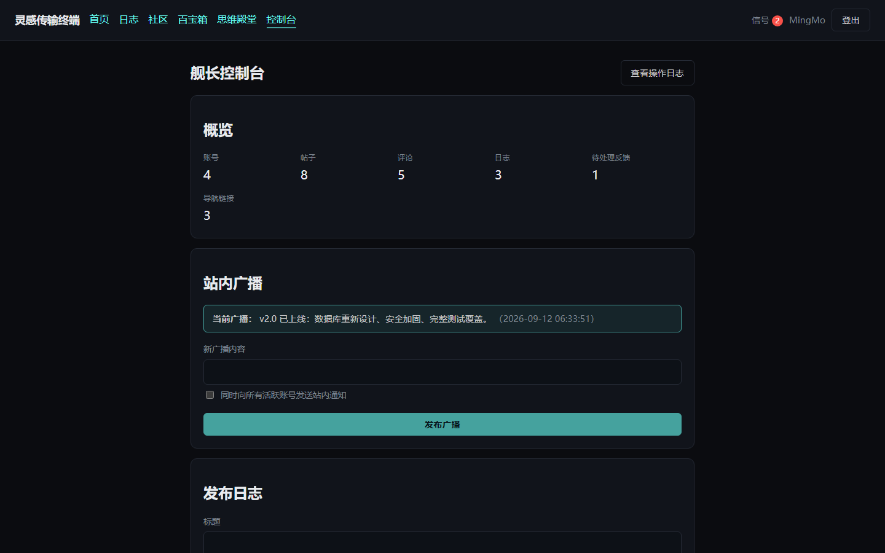 |
| 个人档案：称号、头像与星尘余额 | 舰长控制台：概览、站内广播与发布 |
| 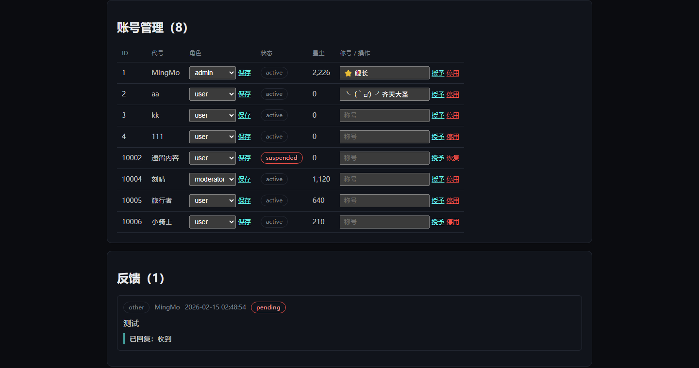 | 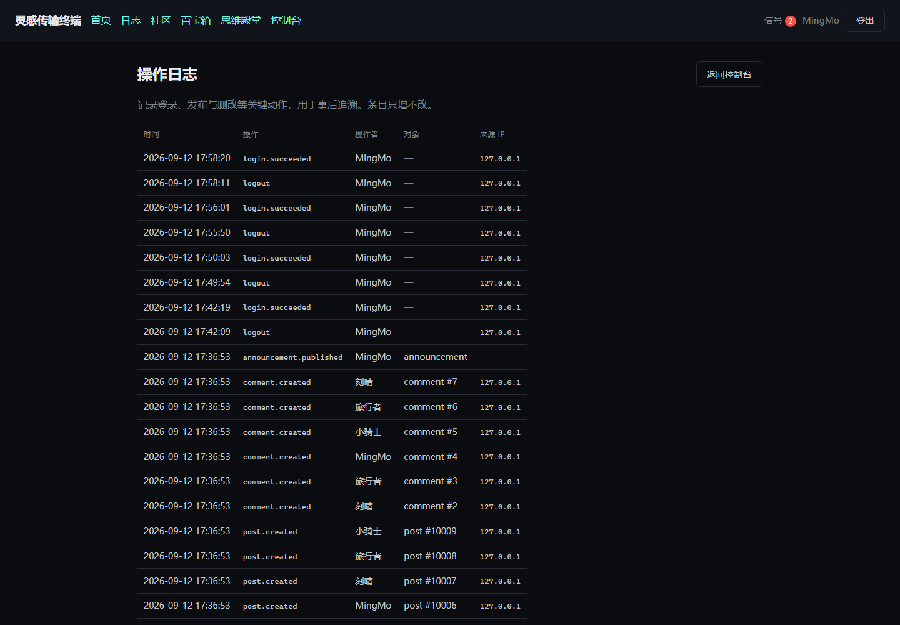 |
| 舰长控制台：账号、角色与状态 | 操作日志：登录、发帖与增删都留痕 |
| 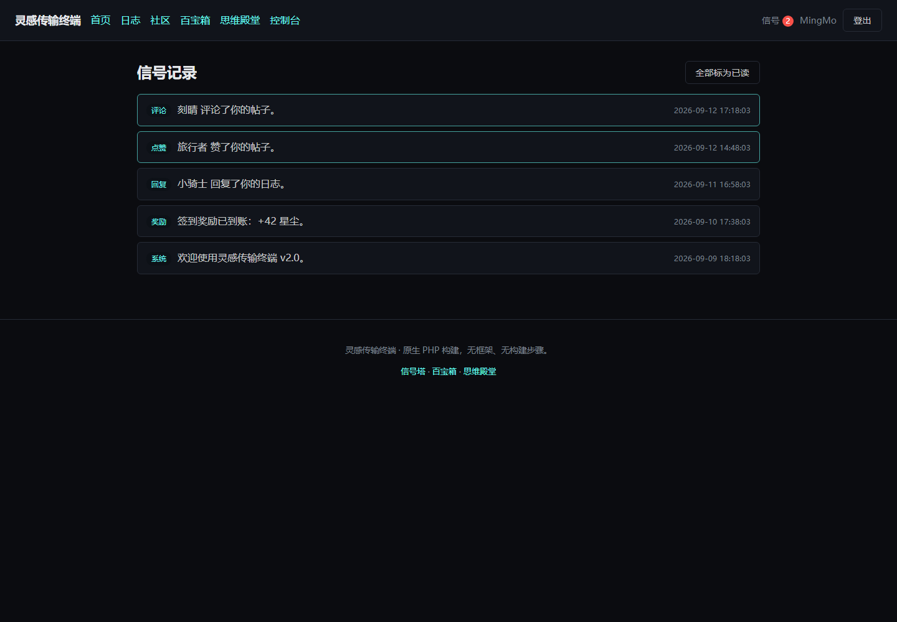 |  |
| 信号记录：通知与未读状态 | 移动端布局：同一套模板，单列排布 |

抓取脚本一共产出 **20 张**截图（含登录页、信号塔表单与移动端首页），
全部放在 [`docs/images/`](docs/images/)，README 只挑了其中 16 张。

所有截图由 [`tools/capture-screenshots.mjs`](tools/capture-screenshots.mjs) 从真实运行的
站点抓取（公开页面在登出状态下抓，其余在登录后抓）。这个脚本会拒绝三件它不该放过的事：

- **重复的图片。** 它比较各张截图的字节数——“十七张截图全是同一张空白页”
  这种失败在图片本身里看不出来。
- **没有解码成功的图片。** 图片加载失败时，它的位置仍然占着，
  于是页面看起来正常，只是多了一个尺寸正确的空洞。Steam 的封面图来自第三方 CDN，
  这条检查就是为它加的。
- **登录状态不对。** 抓取前会先登出，否则浏览器里残留的会话会让“登录页”截成社区页
  ——这正好真实发生过一次。

---

## 项目结构

```
inspiration-terminal/
├── public/                 # 唯一的 Web 根
│   ├── index.php           # 前端控制器
│   └── assets/             # CSS、ES Module、图片
├── src/
│   ├── Database/           # 连接、迁移器、方言适配、旧数据导入
│   ├── Http/               # 请求、响应、路由、内核、视图
│   ├── Repository/         # 数据访问 —— SQL 只允许出现在这里
│   ├── Security/           # 会话、CSRF、校验、加密、上传、安全头
│   ├── Service/            # 业务规则
│   └── Support/            # 配置与环境变量
├── routes/web.php          # 路由表
├── templates/              # 视图
├── database/migrations/    # 迁移，按序号执行
├── bootstrap/              # 自动加载与运行时初始化
├── config/app.php          # 配置（值来自环境变量）
├── tests/                  # 测试套件
├── tools/                  # 静态检查、文档检查、截图、部署与校验脚本
├── bin/                    # 命令行入口
└── docs/                   # 文档
```

**依赖方向是单向的**，并且被 `tools/lint.php` 机械化强制：

```
Http → Service → Repository → Database
                    ↑
              Security（可被各层使用）

SQL 只允许出现在 Repository
业务规则只允许出现在 Service
模板只负责渲染，每个输出必须显式转义
```

---

## 文档

| 文档 | 内容 |
|---|---|
| [`docs/project-overview.md`](docs/project-overview.md) | 项目全貌：23 张表设计、请求流向、四个关键数据流 |
| [`docs/security.md`](docs/security.md) | 威胁模型、已实现措施、已知边界 |
| [`docs/deployment.md`](docs/deployment.md) | 从本地到生产服务器的完整步骤与检查清单 |
| [`docs/interview-questions.md`](docs/interview-questions.md) | 40 题问答，围绕本项目的真实设计与缺陷 |
| [`CHANGELOG.md`](CHANGELOG.md) | 版本变更记录 |
| [`docs/release-notes-v2.0.0.md`](docs/release-notes-v2.0.0.md) | v2.0.0 的发布说明（含升级注意事项） |
| [`SECURITY.md`](SECURITY.md) | 漏洞报送方式与支持范围 |
| [`NOTICE`](NOTICE) | 第三方组件与媒体素材的授权情况 |
| [`LICENSE`](LICENSE) | 代码授权：MIT |
| [`LICENSE-CONTENT.md`](LICENSE-CONTENT.md) | 文字与站点内容授权：CC BY-NC-ND 4.0 |

两份 README 靠人工维护，英文版可能比这里慢半拍——上面的数字与结论以中文版为准。
`tools/check-docs.php` 会检查所有文档的相对链接与编码，但**不会**发现两边内容已经不同步。

两份授权是分开的：代码可以自由取用，站点上的文字和文章不行。
分文件、分名字写，是为了让“到底哪份授权管什么”一眼可辨，
而不是让人在两个都叫 LICENSE 的文件之间猜。代码那份仍然叫 `LICENSE`，
因为**托管平台只会识别这个文件名**——改名成 `LICENSE-CODE.md` 之后，
仓库侧边栏的授权会变成 `NOASSERTION`，那比命名整齐更糟。

---

## 开发

```bash
php tests/run.php              # 全部测试
php tests/run.php --verbose     # 逐条断言
php tools/lint.php              # 静态检查（分层边界、SQL 插值、模板转义、占位符复用）
php tools/lint.php --verbose    # 同时列出被放行的模板输出及其原因
php tools/doctor.php            # 检查配置：密钥、数据库、缓存、目录权限
php tools/check-docs.php        # 文档链接与编码检查
php bin/migrate.php --status    # 迁移状态
php bin/fetch-github.php        # 填充 GitHub 榜单缓存
php tools/verify-deployment.php # 对真实数据库校验约束
php bin/seed-demo.php           # 写入可截图、可演示的样例数据
php bin/refresh-excerpts.php    # 按当前规则重建日志摘要（先干跑，--apply 才写入）
```

### 让模块校验跑在 MySQL 上

默认它跑在 SQLite 上；换成生产引擎只需要四个环境变量。**它会写入样例数据**，
所以必须指向一个一次性数据库，并且显式确认：

```bash
mysql -uroot -e 'CREATE DATABASE inspiration_smoke CHARACTER SET utf8mb4'
DB_DRIVER=mysql DB_DATABASE=inspiration_smoke SMOKE_ALLOW_MYSQL=1 php tools/module-smoke.php
```

没有 `SMOKE_ALLOW_MYSQL=1` 它会拒绝启动，而不是把样例账号和测试帖子写进你指到的库。
schema 由它自己迁移，不需要先跑别的脚本。

### 四个值得单独说一句的工具

**`tools/doctor.php`** 存在的理由是一类**从不报警的错误**。
`APP_KEY` 接受任何 16 字符以上的字符串，所以把一个 GitHub 令牌粘进去，
站点照常运行、加密照常“成功”——只是私密笔记的加密密钥变成了一个还留在
GitHub 界面和 shell 历史里的凭据。没有东西会抱怨，代价要等到轮换密钥时才发现。
这个脚本会把它指出来，并顺手检查数据库连通性、迁移状态、缓存是否为空、
以及会话目录是否可写。它**以退出码报告失败**，所以可以放进部署流程。

**`tools/lint.php`** 里有一条规则值得一提：模板输出必须转义。它对**可能产出**
不可信内容的表达式报错，而对“只返回字符串字面量的三元表达式”这类明确安全的写法放行，
并且把每一次放行都在 `--verbose` 下列出来。**规则如果太吵，就会被无视——
那比没有规则更糟。**

**`tools/check-docs.php`** 检查的是没人会去编译的那个文件：README。
它解析所有文档里的相对链接与图片路径，并检查编码是否被写坏。
加进 CI 的当天它就抓到一个：`docs/release-notes-v2.0.0.md` 里写着
`[docs/deployment.md](docs/deployment.md)`。这个文件本身就在 `docs/` 下，
这条链接因此被解析成 `docs/docs/deployment.md`，一个不存在的路径。
**文档是门面，但它不在编译器的保护范围内。**

**`bin/refresh-excerpts.php`** 处理的是“派生列”的必然问题：
日志摘要是从正文算出来的，规则一改，数据库里的旧值就还在。
它默认只**干跑并列出会改哪些**，加 `--apply` 才写。它对线上库安全、跑两次结果相同，
而且它自己踩过一次坑：最早的版本在 `WHERE` 里拿列和“刚从这一列读出来的值”比较，
条件永远为假——于是它报告“重建了 7 条”，实际一条都没写。

---

## 路线图

这不是“哪里做得不好”，而是“接下来往哪走”。两类东西分开写：
**刻意的取舍**是已经想清楚并接受的代价，**待办**是确实还没做的。

### 刻意的取舍

| 取舍 | 原因 |
|---|---|
| **不用框架** | 见上文[为什么不用框架](#为什么不用框架)：项目规模不需要框架的收益，而写一遍请求生命周期正是目的 |
| **请求内同步处理** | 没有队列。图片压缩与外部接口调用都在请求里完成，因此一个慢的上游会拖慢一次响应 |
| **限流存在数据库** | 换来的是无需额外组件；代价是多实例部署需要换成共享存储 |
| **上游数据落库缓存** | 换来的是不消耗接口额度、无令牌可用、上游挂了页面照常打开；代价是榜单有延迟 |
| **界面只有中文** | 这是中文站点的本来面目，不是待补的语言支持 |
| **旧站迁移脚本只支持 MySQL** | 它的输入按定义就是一个旧的 MySQL 站点，因此不像仓储层那样需要一个 SQLite 对应实现来保持两边兼容 |

### 待办

按“出事的代价”排序，而不是按实现难度。

1. **限流表的定期清理**。`RateLimitRepository::pruneBefore()` 已经写好，
   但没接定时任务，目前需要手动调用。表会一直增长。
2. **真并发集成测试**。目前的并发保证来自数据库约束与探针验证——
   推理充分、验证过，但还没有“起两个进程同时打同一个接口”的测试。
   想把信心从推理换成实测。
3. **`ORDER BY RAND()` 还有一处**（随机跳转到一篇日志）。数据量大时是全表排序，
   正确做法是随机 ID 区间或预生成随机列。
4. **API 错误字段统一**。新代码都用 `message`，少数旧路径仍是 `msg`。

### 想清楚但不打算做

- **多租户**：那会变成另一个产品，而不是这个项目。
- **插件机制**：为一个人的站点引入插件协议，复杂度不会有人受益。
- **管理后台的细粒度权限**：目前三档（成员／版主／管理员）够用，
  再加角色分级只会让判断变复杂。

---

## 贡献

**这是一个个人项目，不接收外部 Pull Request。** 代码公开是为了可被阅读，
而不是为了被共同开发。

如果你发现了**安全问题**，请不要开公开 issue，按 [`SECURITY.md`](SECURITY.md)
的流程私下报送。如果只是发现了普通缺陷或想讨论设计，欢迎开 issue。

---

## 授权

- **代码**：[MIT](LICENSE) —— 随便用，包括商用。
- **站点内容**（文章、截图、文案、图片）：[CC BY-NC-ND 4.0](LICENSE-CONTENT.md) ——
  可以引用和转载（需署名与链接），不可商用、不可改编后再发布。
- **第三方组件**：见 [`NOTICE`](NOTICE)。随仓库分发的 `marked`（MIT）与
  DOMPurify（Apache-2.0）各自保留其许可。

---

<p align="center">
  <sub>界面风格取自若干游戏的视觉语言，属于个人项目的致敬式引用，与这些游戏及其发行商无隶属关系。</sub>
</p>
